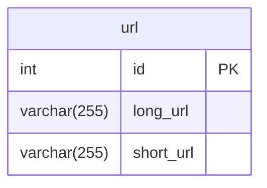
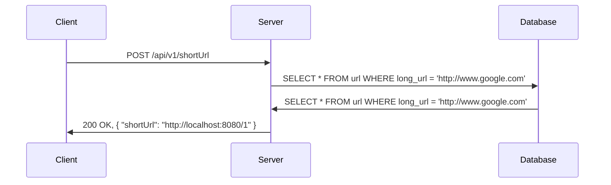

# URL 단축기 설계

## 개략적 설계안 제시

### API 엔드포인트

1. URL 단축용 엔드포인트: POST /api/shorten, 인자로는 longUrl, 단축된 url 을 반환한다.
2. URL 리디렉션용 엔드포인트: GET /api/v1/shortUrl, HTTP 리디렉션 목적지가 될 원래 URL 을 반환한다.

단축 url 을 받은 서버는 그 URL 을 원래 URL 로 바꾸어서 301 응답의 Location 헤더에 넣어 반환한다. 그럼 클라이언트는 원래의 URL 을 방문하게 된다.

유의할 점은 301 과 302 응답의 차이이다. 둘 다 리디렉션 응답이긴 하지만 차이가 있다.

- 301 Permanently Moved: 요청한 리소스가 새로운 URL 로 영구적으로 이동되었음을 나타낸다. 브라우저는 이 응답을 cache 한다.
- 302 Found: 요청한 리소스가 일시적으로 다른 URL 로 이동되었음을 나타낸다. 따라서 클라이언트의 요청은 언제나 단축 URL 서버로 먼저 보내진 후에 리디렉션되어야 한다.

서버 부하를 줄이는 것이 중요하다면 301 을 쓰는 것이 좋은데 첫 번째 요청만 단축 URL 서버로 전송될 것이기 때문이다.
하지만 트래픽 분석이 중요할 때는 302 를 쓰는 쪽이 클릭 발생률이나 발생 위치를 추적하는 데 좀 더 유리할 것이다.

URL 리디렉션을 구현하는 가장 직관적인 방법은 해시 테이블을 사용하는 것이다. 단축 URL 을 키로, 원래 URL 을 값으로 사용한다.

### URL 단축

중요한 것은 긴 URL 을 해시 값으로 대응시킬 해시 함수 fx 를 찾는 일이 될 것이다.

## 상세 설계

### 데이터 모델

개략적 설계에서는 모든 것을 해시 테이블에 두었지만, 실제 시스템에 쓰기에는 곤란한데, 메모리는 유한한데다가 비싸기 때문이다.

그래서 데이터베이스를 사용해야 한다. 데이터베이스에는 다음과 같은 테이블이 필요하다.

### 해시 함수

편의상 해시 함수가 계산하는 단축 URL 값을 hashValue 라고 지칭한다.

#### 해시 값 길이

hashValue 는 [0-9a-zA-Z] 의 문자열이다. 따라서 hashValue 의 길이는 62 가지 문자로 이루어진 문자열이다.
hashValue 의 길이를 7 로 한다면 62^7 = 3,521,614,606,208 개의 단축 URL 을 만들 수 있다. 요구사항을 만족시키기에 충분한 값이므로
hashValue 의 길이는 7 로 한다.

해시 함수 구현에 쓰일 기술로는 두 가지 방법을 살펴본다.

- 해시 후 충돌 해소
- base-62 변환

#### 해시 후 충돌 해소

잘 알려진 해시 함수를 사용하여 해시 값을 계산했을 때, 가장 짧은 해시 값조차 7자리보다는 길다. 이 문제를 해결할 첫 번째 방법은
계산된 해시 값에서 처음 7개 글자만 이용하는 것이다. 하지만 이렇게 하면 해시 결과가 서로 충돌할 확률이 높아진다.

충돌이 발생하면 사전에 정의한 문자열을 해시값에 덧붙인다. 이 방법을 쓰면 충돌을 해소할 수 있지만 단축 URL 을 생성할 때 한 번 이상
데이터베이스 질의를 해야 하므로 오버헤드가 크다. 데이터베이스 대신 블룸 필터를 사용하면 성능을 높일 수 있다.

#### base-62 변환

진법 변환(base conversion)은 URL 단축기를 구현할 때 흔히 사용되는 접근법이다. 62진법을 쓰는 이유는 hashValue 에 사용할 수 있는 문자 개수가 62 개이기 때문이다.

### URL 단축기 상세 설계

1. 입력으로 긴 URL 을 받는다
2. 데이터베이스에 해당 URL 이 있는지 검사한다.
3. 데이터베이스에 있다면 해당 URL 에 대한 단축 URL 을 만든 적이 있는 것이다. 따라서 데이터베이스에서 해당 단축 URL 을 가져와서 클라이언트에게 반환한다.
4. 데이터베이스에 없는 경우에는 유일한 ID 를 생성한다. 이 ID 는 데이터베이스의 기본 키로 사용한다.
5. ID 를 base-62 로 변환한다.
6. ID, 단축 URL, 원래 URL 로 새 데이터베이스 레코드를 만든 후 단축 URL 을 클라이언트에 전달한다.

ID 를 생성할 때는 전역적 유일성이 보장되는 것이여야 한다.
