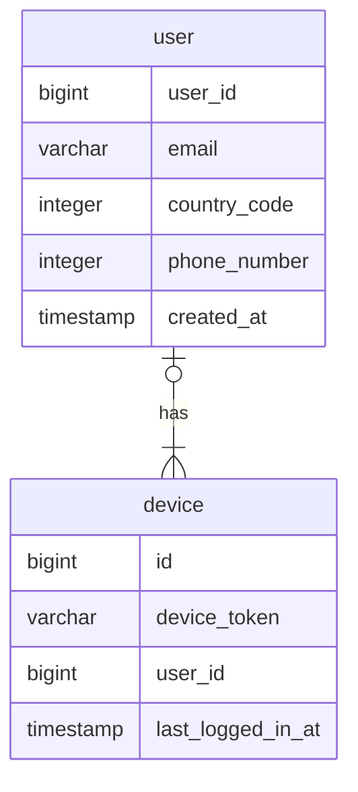

## 문제 이해 및 설계 범위 확정

- 푸시 알림, SMS 메시지, 이메일을 지원해야 한다.
- 연성 실시간 시스템이라고 가정한다. 알림은 가능한 한 빨리 전달되어야 하지만 시스템에 높은 부하가 걸렸을 때 약간의 지연은 무방한다.
- iOS, Android, 데스크톱을 지원해야 한다.
- 알림은 클라이언트 애플리케이션 혹은 서버 측에서 스케쥴링으로 생성할 수 있다.
- 사용자는 알림을 받지 않도록 설정할 수 있다.
- 천만 건의 모바일 푸시 알림, 백만 건의 SMS 메시지, 5백만 건의 이메일을 보낼 수 있어야 한다.

## 개략적 설계안

- 알림 유형별 지원 방안
- 연락처 정보 수집 절차
- 알림 전송 및 수신 절차

### 알림 유형별 지원 방안

#### iOS 푸시 알림

iOS 에서 푸시 알림을 보내기 위해서는 세 가지 컴포넌트가 필요하다.

- 알림 제공자(provider): 알림 요청(notification request)을 만들어 애플 푸시 알림 서비스(APNS: Apple Push Notification Service)로 보내는 주체
- APNS: 애플이 제공하는 원격 서비스. 푸시 알림을 iOS 장치로 보내는 역할을 담당
- iOS 단말: 푸시 알림을 수신하는 사용자 단말

#### 안드로이드 푸시 알림

안드로이드 푸시 알림도 비슷한 절차로 전송된다. APNS 대신 FCM(Firebase Cloud Messaging)을 사용한다는 점만 다르다.

#### SMS 메시지

#### 이메일

### 연락처 정보 수집 절차

알림을 보내려면 모바일 단말 토큰, 전화번호, 이메일 주소 등의 정보가 필요하다. 사용자가 앱을 설치하거나 처음으로 계정을 등록하면 API 서버는 해당 사용자의 정보를 수집하여 데이터베이스에 저장한다.

### 알림 전송 및 수신 절차

### 개선된 설계안

- 데이터베이스와 캐시를 알림 시스템의 주 서버에서 분리한다.
- 알림 서버를 증설하고 자동으로 수평적 규모 확장이 이루어질 수 있도록 한다.
- 메시지 큐를 이용해 시스템 컴포넌트 사이의 강한 결합을 끊는다.

## 마무리

- 안정성
- 보안: 인증된 클라이언트만이 알림을 보낼 수 있도록 appKey, appSecret 등의 매커니즘을 이용한다.
- 이벤트 추적 및 모니터링
- 사용자 설정
