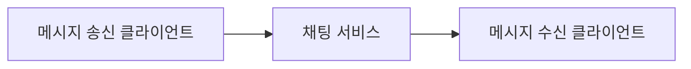
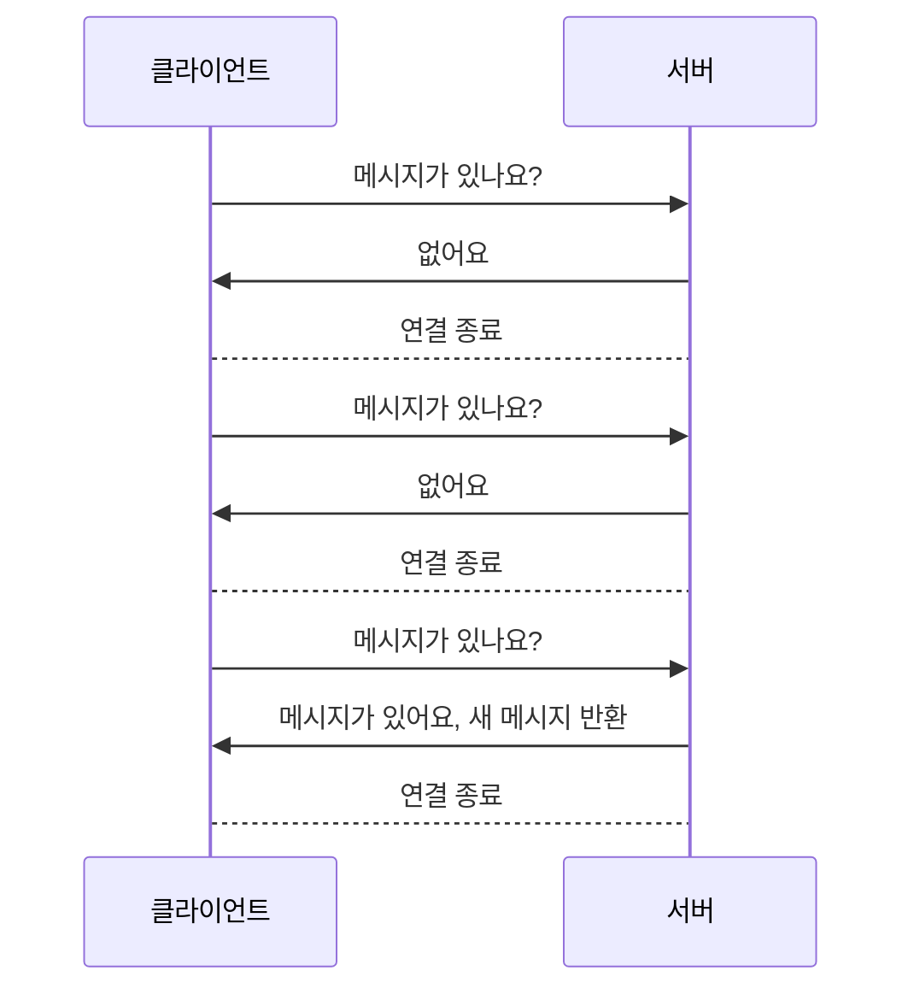
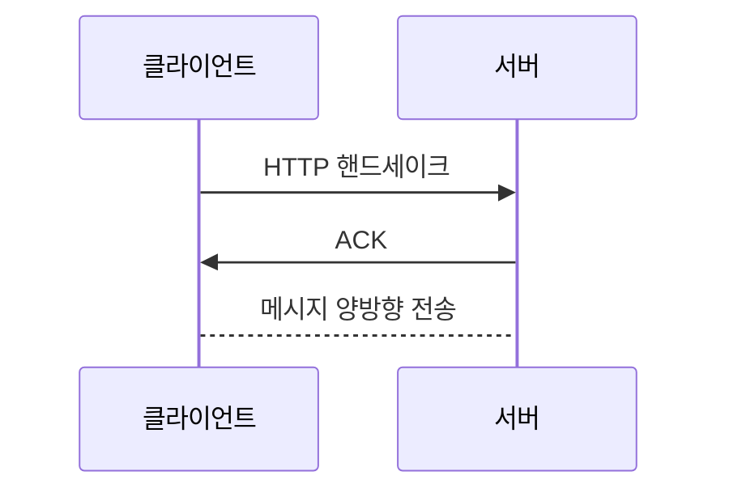

# 채팅 시스템 설계

채팅 시스템을 설계할 때는 어떤 목적을 가진 앱인지를 명확하게 하는 것이 중요하다. 적극적으로 질문하여 목적을 파악하고, 그 목적에 맞는 설계를 해야 한다.

## 설계 범위 확정

이번 장에서는 페이스북 메신저와 유사한 채팅 앱을 설계해 볼 것이다. 이 앱은 다음과 같은 기능을 제공한다.

- 응답지연이 낮은 1:1 채팅
- 최대 100명까지 참여할 수 있는 그룹 채팅
- 사용자의 접속상태 표시 기능
- 다양한 단말 지원, 하나의 계정으로 여러 단말에 동시 접속 지원
- 푸시 알림
- 5천만 DAU

## 개략적 설계안

채팅 시스템의 경우 클라이언트는 모바일 앱이거나 웹 애플리케이션이다. 클라이언트는 서로 직접 통신하지 않는다.

- 클라이언트들로부터 메시지 수신
- 메시지 수신자 결정 및 전달
- 수신자가 접속 상태가 아닌 경우에는 접속할 때까지 해당메시지 보관

채팅을 시작하려는 클라이언트는 네트워크 통신 프로토콜을 사용하여 서비스에 접속한다. 따라서 채팅 서비스의 경우 어떤 통신 프로토콜을 사용할 것인가도 중요한 문제다. 면접관과 상의하도록 하자.

### 폴링

폴링은 클라이언트가 주기적으로 서버에게 새 메시지가 있느냐고 물어보는 방법이다.

답해줄 메시지가 없는 경우는 서버 자원이 불필요하게 낭비된다는 문제가 있다.

### 롱 폴링

롱 폴링은 폴링의 단점을 보완하기 위해 만들어진 방법이다. 클라이언트가 서버에게 메시지가 있느냐고 물어보면 서버는 새 메시지가 있을 때까지 대기한다. 새 메시지가 있으면 클라이언트에게 전달하고, 없으면 클라이언트에게 응답한다.

이 방법은 다음과 같은 약점이 있다.

- 송신 클라이언트와 수신 클라이언트가 같은 채팅 서버에 접속하게 되지 않을 수도 있다.
- 서버 입장에서는 클라이언트가 연결을 해제했는지 아닌지 알 좋은 방법이 없다.
- 여전히 비효율적이다.

### 웹소켓

웹소켓(WebSocket)은 서버가 클라이언트에게 비동기 메시지를 보낼 때 가장 널리 사용하는 기술이다.

웹소켓 연결은 클라이언트가 시작한다. 한번 맺어진 연결은 항구적이며 양방향이다.
